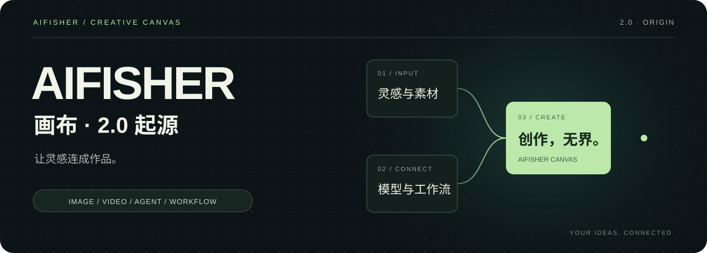

<p align="center">
  
</p>

<p align="center">
  <strong>一张画布，连接图片、视频、音频、文字与 AI 工作流。</strong><br />
  从灵感到素材，从分镜到生成，把创作过程留在同一个空间。
</p>

<p align="center">
  <a href="https://api.work-fisher.com/"><strong>AIFISHER API ↗</strong></a> ·
  <a href="#创作案例">创作案例</a> ·
  <a href="#开始使用">开始使用</a> ·
  <a href="https://github.com/Work-Fisher/AIFISHER/releases">版本发布</a> ·
  <a href="LICENSE">非商业许可</a>
</p>

---

> ### 连接 AIFISHER API，开始画布创作
>
> **[前往 AIFISHER API · 注册 / 登录并获取 API Key →](https://api.work-fisher.com/)**
>
> 在 API 站创建并复制自己的 Key，打开画布的 **设置 → 闭源服务 → AIFISHER API**，粘贴并保存，即可使用相应的在线模型服务。
>
> 画布账号与 API 站账号分别管理；本地画布无需登录即可使用。在线生成按服务商实际规则计费，软件不附带免费模型额度。

## 创作案例

以下选自随画布提供的风格与运镜素材库，展示可浏览的视觉方向；实际生成效果取决于模型、提示词与参考素材。

<table>
  <tr>
    <td width="33%"><a href="public/creative-presets/style-643.webp"></a></td>
    <td width="33%"><a href="public/mj-styles/char6-preview.webp"></a></td>
    <td width="33%"><a href="public/mj-styles/char7-preview.webp"></a></td>
  </tr>
  <tr>
    <td><strong>01 / 动画风格</strong><br />鲜明配色 · 角色与场景</td>
    <td><strong>02 / 生活人像</strong><br />自然光线 · 日常氛围</td>
    <td><strong>03 / 科幻影像</strong><br />电影光色 · 人物特写</td>
  </tr>
</table>

### 让画面动起来

点击封面打开视频，在 GitHub 文件页播放或下载。

<table>
  <tr>
    <td width="50%"><a href="https://github.com/Work-Fisher/AIFISHER/blob/main/public/creative-presets/motion-692.mp4"></a></td>
    <td width="50%"><a href="https://github.com/Work-Fisher/AIFISHER/blob/main/public/creative-presets/motion-659.mp4"></a></td>
  </tr>
  <tr>
    <td><strong>▶ 环绕上升</strong><br />人物、空间与镜头运动</td>
    <td><strong>▶ 希区柯克变焦</strong><br />前后景变化与视觉张力</td>
  </tr>
</table>

## 在同一张画布里完成

| 连接素材 | 连接模型 | 连接创作流程 |
| :--- | :--- | :--- |
| 图片、视频、音频与文字节点 | AIFISHER API 与其他模型服务 | Agent 辅助规划与操作 |
| 引用素材、参数调整与生成结果 | 本地 ComfyUI 与 RunningHub | API 工作流导入与参数配置 |
| 项目与素材保存在本机 | 使用自己的服务商 API Key | 公开 SKILL 与自定义技能 |

## 开始使用

**使用安装版**：查看 [版本发布](https://github.com/Work-Fisher/AIFISHER/releases) 或 [官方下载网盘](https://pan.quark.cn/s/4902ac63461c)。GitHub 安装包会在验收完成后发布；已安装的正式版继续接收官方签名自动更新。

**运行源码**：按下方步骤启动。源码保留 API 接入和可选账号功能，通过 Git 拉取后续更新；安装器不用于覆盖源码目录。

> **源码公开，仅限非商业用途。** 禁止接单、商业制作、倒卖安装包、商业二开或收费托管。完整条款见 [LICENSE](LICENSE)。本项目不属于 OSI 定义的开源许可。

<details>
<summary><strong>公开源码包含什么？</strong></summary>

画布、Agent、模型接入、本地 ComfyUI、RunningHub、可选账号及已获公开再分发授权的风格 / MJ 码图素材。作者保留的闭源 SKILL 正文、私有共享模板、个人账户与密钥不在公开范围内。正式安装包可能包含闭源内容，详见 [公开范围](SOURCE-SCOPE.md)。

</details>

## 环境与运行

需要 **Windows x64、Node.js 24.20.0 与 npm**。本地 ComfyUI 需另行安装；在线模型需自行配置相应服务商的有效 API Key。

```powershell
npm ci
npm --prefix apps/desktop ci
npm run desktop:dev
```

首次启动会按 Electron npm 包自带校验值下载桌面运行时，需要联网。

运行目录中的 `.desktop-dev/` 保存源码版的本机工作区。不要将它提交或分享给别人。使用设置界面保存 API Key；密钥由当前 Windows 用户的 DPAPI 加密，不要把真实密钥写入示例配置。

```powershell
npm run check
```

该命令执行类型检查、公开范围测试和前端/桌面启动页构建。自动测试不会调用付费生成。视频转码与音频处理等操作需要可用的 FFmpeg/ffprobe；本源码快照不附带运行时二进制，也不安装 ComfyUI 或模型权重。

## 数据与网络

项目默认保存在本机。你主动调用在线模型时，相关提示词和参考素材会发送到选定服务商。请先了解其收费、隐私和使用条件。“本地画布”不代表所有模型均在本地运行或所有素材永不上传。

官方账号与设备身份服务会联网；未登录时也可能向官方服务发送设备标识和调用诊断。诊断包括应用版本、模型与服务商、调用状态、耗时、错误阶段、HTTP 状态、请求/任务标识及脱敏后的错误摘要，用于定位问题。诊断上报不以收集 API Key、完整提示词或原始素材为目的；提交意见反馈时，你主动附加的文件会发送至反馈服务。

## 反馈

请提供版本、复现步骤和脱敏日志。ComfyUI 问题请附最小可复现的 API JSON。提交前移除账号、API Key、私人路径和私人素材。

## 许可

自有代码采用 [AIFISHER Noncommercial Source License 1.0](LICENSE)。允许非商业学习、研究、修改和免费再分发，禁止将本软件用于商业目的，包括接单。生成内容不会因此自动归作者所有，但不能使用本软件完成商业生产。

第三方组件保留其原有许可，见 [THIRD-PARTY-NOTICES.md](THIRD-PARTY-NOTICES.md)。闭源 SKILL 不在本仓库许可范围内。软件不附带任何模型账户、API Key 或服务额度。
